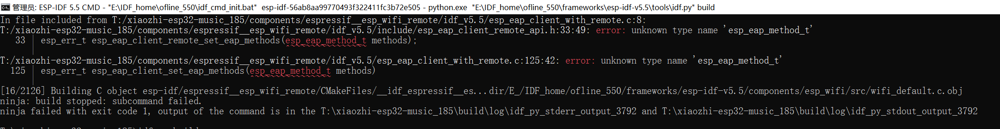

# 使用说明 

* [M5Stack Tab5 docs](https://docs.m5stack.com/zh_CN/core/Tab5)

## 快速体验

下载编译好的 [固件](https://pan.baidu.com/s/1dgbUQtMyVLSCSBJLHARpwQ?pwd=1234) 提取码: 1234 

```shell
esptool.py --chip esp32p4 -p /dev/ttyACM0 -b 460800 --before=default_reset --after=hard_reset write_flash --flash_mode dio --flash_freq 80m --flash_size 16MB 0x00 tab5_xiaozhi_v1_addr0.bin 
```

## 基础使用

* idf version: v5.5-dev

1. 设置编译目标为 esp32p4

```shell
idf.py set-target esp32p4 
```

2. 修改配置 

```shell
cp main/boards/m5stack-tab5/sdkconfig.tab5 sdkconfig
```

3. 编译烧录程序

```shell
idf.py build flash monitor
```

> [!NOTE]
> 进入下载模式：长按复位按键（约 2 秒），直至内部绿色 LED 指示灯开始快速闪烁，松开按键。


## log

@2025/05/17 测试问题

1. listening... 需要等几秒才能获取语音输入???
2. 亮度调节不对
3. 音量调节不对
 
## TODO



 components\espressif__esp_wifi_remote\idf_v5.5\include\esp_eap_client_remote_api.h

#ifndef ESP_EAP_METHOD_T
#define ESP_EAP_METHOD_T
typedef enum {
    ESP_EAP_METHOD_PEAP = 0,
    ESP_EAP_METHOD_TTLS,
    ESP_EAP_METHOD_TLS,
    ESP_EAP_METHOD_FAST
} esp_eap_method_t;
#endif


**合并BIN：**

```bash
idf.py merge-bin -o xiaozhi-tab5.bin -f raw
```

idf.py -p COM1140 -b 1152000 flash


需要进入[小智后台](https://xiaozhi.me/)，找到对应设备，修改角色配置，替换音乐播放逻辑，如果想返回原来状态，删除对应内容即可。 
- 选择 DeepSeekV3 大语言模型
- 在人物介绍中末尾加入
  - 收到音乐相关的需求时，只使用 MPC tool `self.music.play_song` 工具，同时禁止使用 `search_music` 功能。

- 电台选择：根据用户需求从预设的电台列表中模糊搜索，如果找不到则随机选择一个电台播放。预设电台：80后音悦台（ID: 20207761）、流行音乐（ID: 4938）、清晨音乐（ID: 4915）、长沙城市之声（ID: 4237）、怀旧（ID: 1223）。