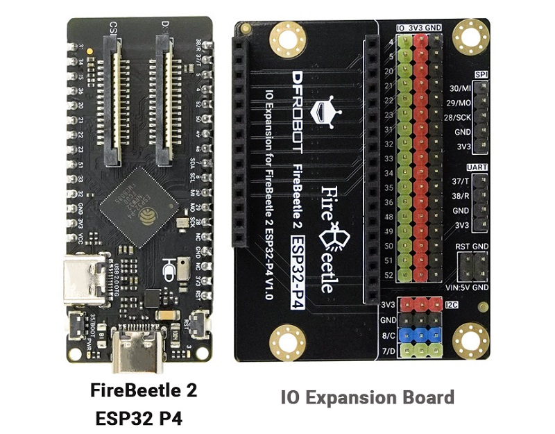
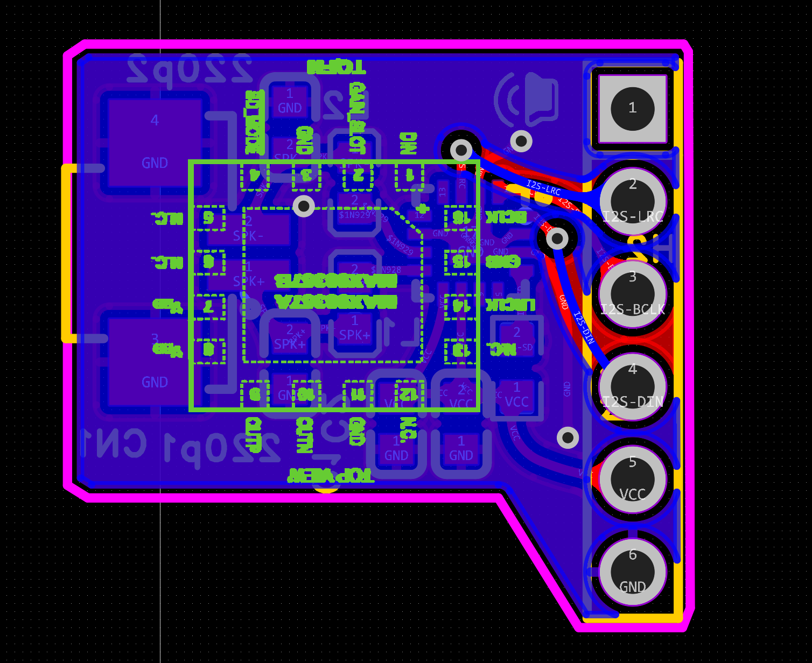

https://www.dfrobot.com.cn/goods-4159.html


32MB PSRAM
Flash：16MB


1. 设置编译目标为 esp32p4

```shell
idf.py set-target esp32p4 
```


Xiaozhi Assistant -> Board Type -> waveshare—nano

**修改 psram 配置：**

```
Component config -> ESP PSRAM -> SPI RAM config -> Mode (QUAD/OCT) -> QUAD Mode PSRAM
```

**修改 Flash 配置：**

```
Serial flasher config -> Flash size -> 16 MB
Partition Table -> Custom partition CSV file -> partitions/v1/16m.csv
```

**编译：**

```bash
idf.py build
```

**合并BIN：**

```bash
idf.py merge-bin -o xiaozhi-qmsw.bin -f raw
```
idf.py -p COM139 -b 1152000flash





